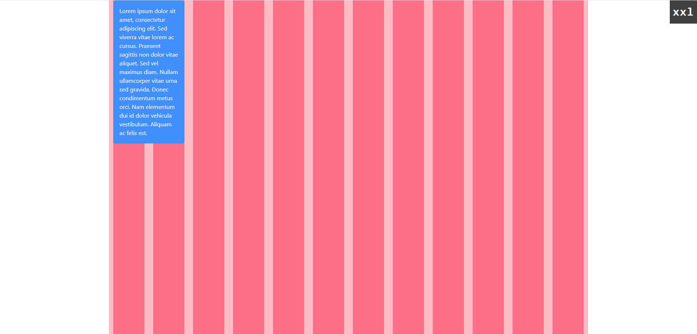
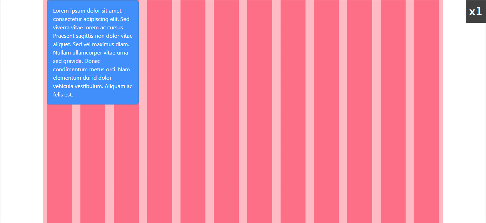
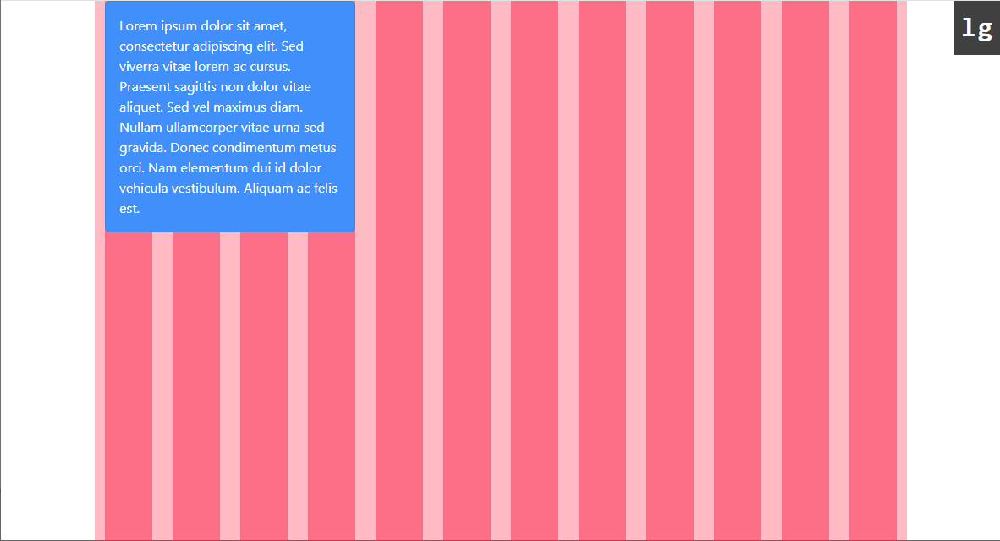
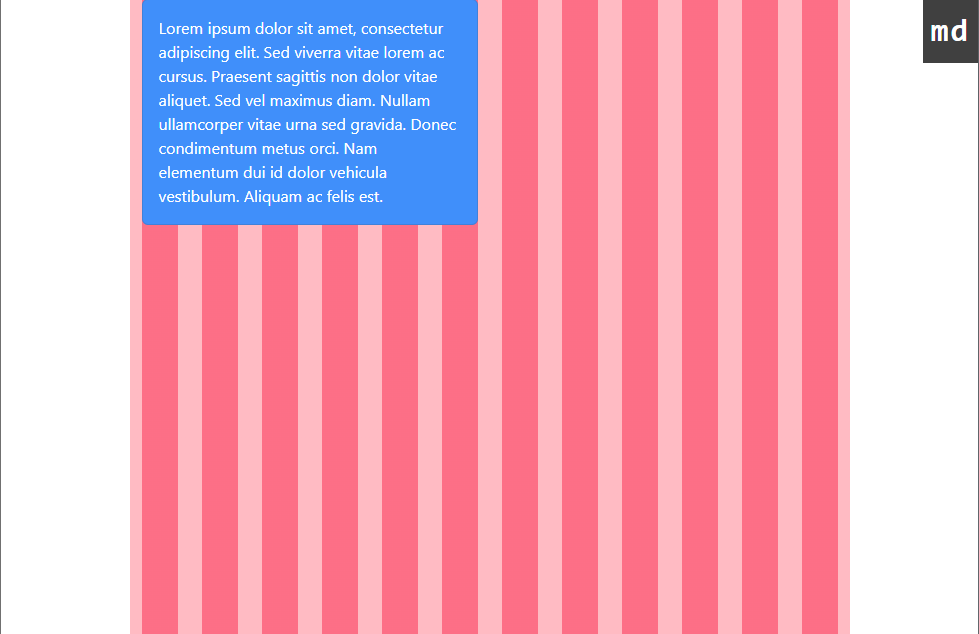
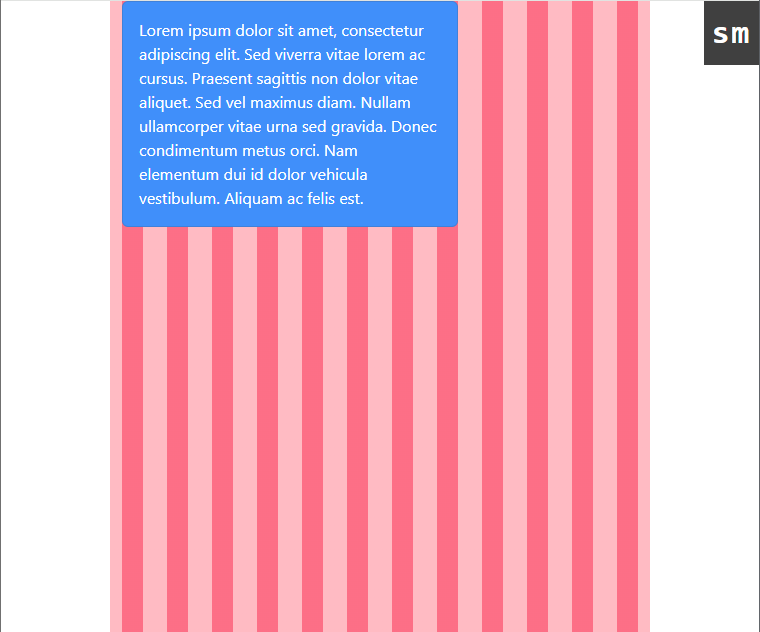

## Boostrap Grid Debugger


### Usage

usage with React.js, Vue.js

```
import "@dchandrashekhar/bootstrap-grid-debugger/dist/index.css";
```

to debug `bootstrap container` add these classes to container `grid for-container`

```
import "@dchandrashekhar/bootstrap-grid-debugger/dist/index.css";
import "bootstrap/dist/css/bootstrap.min.css";

function App() {
  return (
      // added grid for-container class here
    <div className="container grid for-container">
      <div className="row">
        <div className="col-xxl-2 col-xl-3 col-lg-4 col-md-6 col-sm-8">
          <div className="card bg-primary text-white">
            <div className="card-body">
              Lorem ipsum dolor sit amet, consectetur adipiscing elit. Sed
              viverra vitae lorem ac cursus. Praesent sagittis non dolor vitae
              aliquet. Sed vel maximus diam. Nullam ullamcorper vitae urna sed
              gravida. Donec condimentum metus orci. Nam elementum dui id dolor
              vehicula vestibulum. Aliquam ac felis est.
            </div>
          </div>
        </div>
      </div>
    </div>
  );
}

export default App;
```

# XXL (col-xxl-2)



# XL (col-xl-3)



# LG (col-lg-4)



# MD (col-md-6)



# SM (col-sm-8)



---

Similarly to debug `bootstrap container-fluid` add these classes to container `grid for-container-fluid`

Made with ❤
